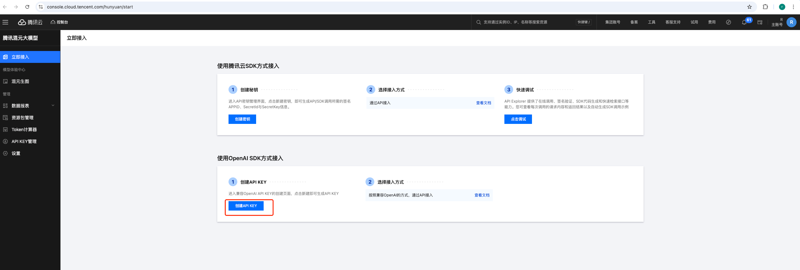
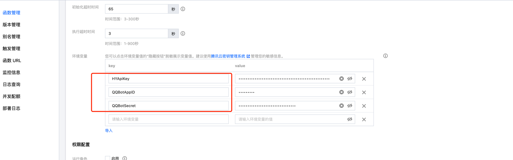
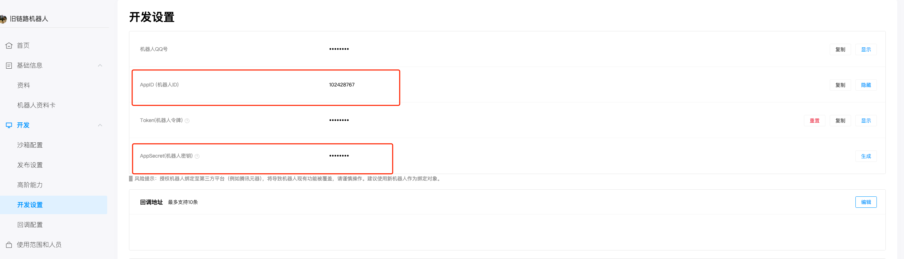
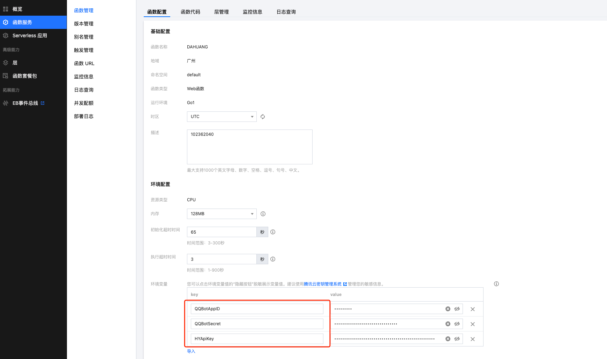

# QQ机器人服务端
## 注意事项
1. websocket 事件推送链路将在24年年底前逐步下线，后续官方不再维护。
2. 新的webhook事件回调链路目前在灰度验证，灰度用户可体验通过页面配置事件监听及回调地址。如未在灰度范围，可联系QQ机器人反馈助手开通。


demo服务可部署在server/serverless节点上。quick start章节介绍了如何将服务端部署到腾讯云scf上（serverless），便于快速体验、验证。

## quick start
### 1. QQ机器人创建与配置
1. 创建开发者账号，创建QQ机器人 [QQ机器人开放平台](https://q.qq.com/qqbot)


2. 配置沙箱成员 (QQ机器人上线前，仅沙箱环境可访问)。新创建机器人会默认将创建者加入沙箱环境。


### 2. 开通混元大模型服务，创建apikey

[开通混元大模型服务](https://console.cloud.tencent.com/hunyuan/start)


[创建混元apikey](https://console.cloud.tencent.com/hunyuan/start)，




### 3. 云函数创建与配置
1. 腾讯云账号开通scf服务 [快速入门](https://cloud.tencent.com/document/product/1154/39271)
2. 创建函数

* 选择模板


* 启用"公网访问"、"日志投递"


* 编辑云函数，启用"固定公网出口IP" （QQ机器人需要配置IP白名单，仅白名单内服务器/容器可访问OpenAPI）


* 编辑云函数，设定环境变量



需要设定的环境变量：

QQBotAppID、QQBotSecret：QQ机器人appid、secret。获取地址：https://q.qq.com/qqbot/#/developer/developer-setting



HYApiKey：混元api key。获取地址 https://console.cloud.tencent.com/hunyuan/api-key



### 4. 更新构建云函数部署包
* 执行Makefile中build指令 
* 将scf_bootstrap、qqbot-demo(二进制文件)打包，上传至云函数

### 5.配置QQ机器人事件监听、回调地址、IP白名单

1. 复制云函数地址 + "/qqbot"后缀，填入回调地址输入框。点击确认。


2. 勾选 C2C_MESSAGE_CREATE 事件。点击确认。


3. 将云函数 "固定公网出口IP" 配置到IP白名单中）


## 体验与机器人的对话

QQ扫码后和机器人对话：https://q.qq.com/qqbot/#/usage-and-personnel


## 已接入服务改造方法
如果已通过websocket/webhook接入QQ机器人开放平台，仅需做两步改造：
1. 去掉注册session的逻辑
2. 启动http服务接收回调请求：
```go

import (
    ...
    "github.com/tencent-connect/botgo/interaction/webhook"
    ...
)

var api openapi.OpenAPI

func main() {
    //创建oauth2标准token source
    tokenSource := token.NewQQBotTokenSource(
		&token.QQBotCredentials{
            AppID:     "",
            AppSecret: "",
		})
    //启动自动刷新access token协程。按需启动。如不启动，access token以被动方式刷新。
    if err = token.StartRefreshAccessToken(ctx, tokenSource); err != nil {
        log.Fatalln(err)
    }
    // 初始化 openapi，正式环境 
    api = botgo.NewOpenAPI(credentials.AppID, tokenSource).WithTimeout(5 * time.Second).SetDebug(true)
    // 注册事件处理函数 
    _ = event.RegisterHandlers(
    // 注册c2c消息处理函数 
        C2CMessageEventHandler(),
    )
    //注册回调处理函数 
    http.HandleFunc(path_, func (writer http.ResponseWriter, request *http.Request) {
    webhook.HTTPHandler(writer, request, credentials)
    })
// 启动http服务监听端口 
    if err = http.ListenAndServe(fmt.Sprintf("%s:%d", host_, port_), nil); err != nil {
        log.Fatal("setup server fatal:", err)
    }
}

// C2CMessageEventHandler 实现处理 at 消息的回调
func C2CMessageEventHandler() event.C2CMessageEventHandler {
    return func (event *dto.WSPayload, data *dto.WSC2CMessageData) error {
    //TODO use api do sth.
        return nil
    }
}

```