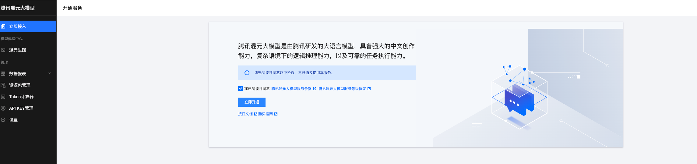

# QQ机器人服务端（webhook）
目前QQ机器人webhook事件回调在灰度验证，灰度用户可体验通过页面配置事件监听及回调地址。未灰度到的用户可通过原有websocket方式接入。

机器人体验账号（QQ扫码后可对话）

## quick start
1. 完成[准备工作](#准备工作)
2. 配置QQ机器人事件监听与回调地址  

* 复制云函数地址 + "/qqbot"后缀，填入回调地址输入框。点击确认。

* 勾选 C2C_MESSAGE_CREATE 事件。点击确认。

3. 在config.yaml中配置QQ机器人账号、腾讯云账号
4. 执行Makefile中build指令
5. 将config.yaml、scf_bootstrap、qqbot-demo(二进制文件)打包，上传至云函数

6. 体验与QQ机器人的对话

## 准备工作
### 云函数创建与配置
1. 腾讯云账号开通scf服务 [快速入门](https://cloud.tencent.com/document/product/1154/39271)
2. 创建函数

* 选择模板

* 启用"公网访问"、"日志投递"

3. 编辑云函数，启用"固定公网出口IP" （QQ机器人需要配置IP白名单，仅白名单内服务器/容器可访问OpenAPI）

### QQ机器人创建与配置
1. 创建开发者账号，创建QQ机器人 [QQ机器人开放平台](https://q.qq.com/qqbot)

2. 配置沙箱成员 (QQ机器人上线前，仅沙箱环境可访问)

3. IP白名单配置（将云函数 "固定公网出口IP" 配置到IP白名单中）

### 腾讯云账号开通混元模型服务

1. [创建秘钥](https://console.cloud.tencent.com/hunyuan/start)，获得访问腾讯云api的SecretID、SecretKey（如果已有无需重复）

2. 打开 腾讯混元大模型服务

其它可参考 [快速入门](https://cloud.tencent.com/document/product/1729/97730#d24be719-0c66-4cd9-93cd-cfc5326995f2)

git remote add github https://github.com/HiRyanLee/QQBotDemo.git
git branch -M main
git push -u origin main